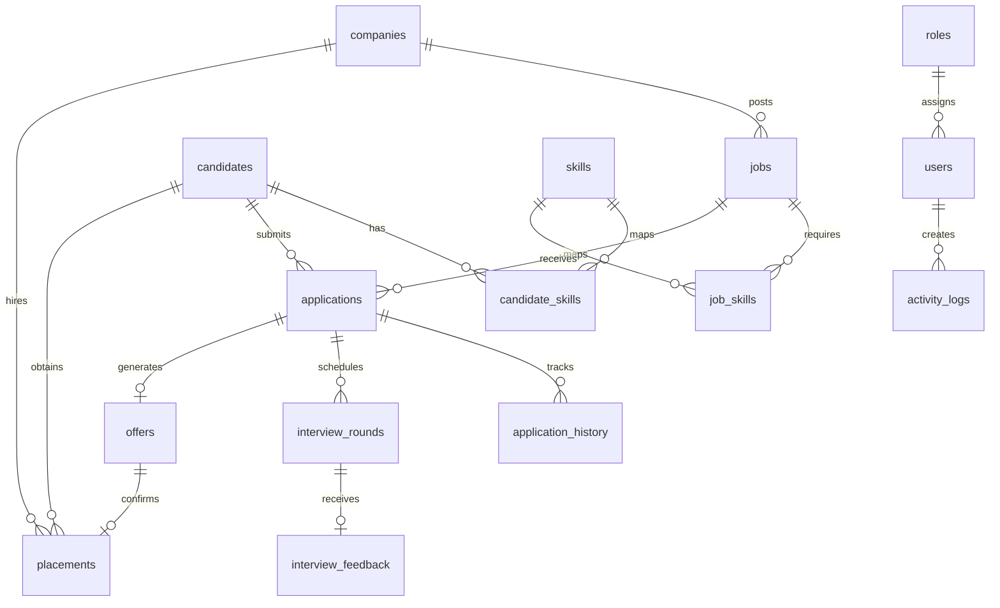

# RPMS Entity Relationship Diagram

```mermaid
erDiagram
 roles ||--o{ users : assigns
 candidates ||--o{ candidate_skills : has
 skills ||--o{ candidate_skills : maps
 companies ||--o{ jobs : posts
 jobs ||--o{ job_skills : requires
 skills ||--o{ job_skills : maps
 candidates ||--o{ applications : submits
 jobs ||--o{ applications : receives
 applications ||--o{ application_history : tracks
 applications ||--o{ interview_rounds : schedules
 interview_rounds ||--o| interview_feedback : receives
 applications ||--o| offers : generates
 offers ||--o| placements : confirms
 candidates ||--o{ placements : obtains
 companies ||--o{ placements : hires
 users ||--o{ activity_logs : creates
```

The 17-table design follows the database specification. Candidates and jobs are many-to-many through applications; skill relationships use mapping tables.
